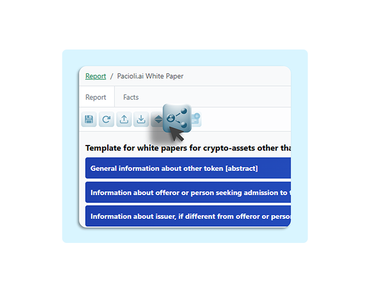

# Collaborate

Now you can work with legal counsel, accounting, engineering and your ESG teams on the same disclosure model and each disclosure.&#x20;

The collaborative features revolutionize compliance processes by enabling real-time multi-user editing, automated version tracking, and integrated feedback loops.&#x20;

<figure><figcaption></figcaption></figure>

These tools save time through streamlined workflows, eliminating sequential reviews and reducing turnaround from days to hours.&#x20;

Cost savings arise from minimized manual labor and avoidance of costly compliance fines.&#x20;

Errors are eliminated via collective scrutiny and audit trails, while risks diminish through enhanced accuracy, traceability, and proactive issue resolution, fostering a resilient regulatory ecosystem.
