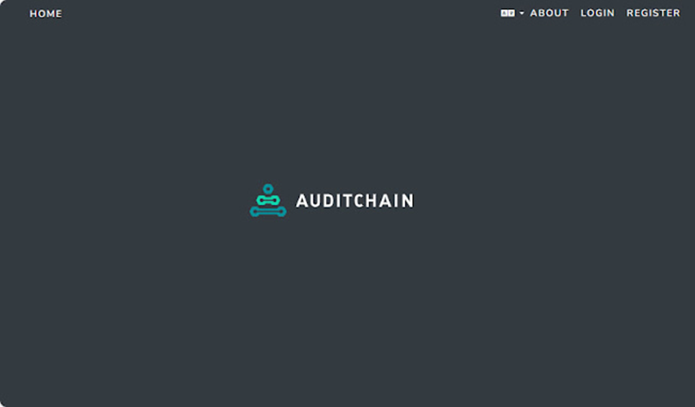

# Getting Started

### STEP 1 - Go to the private beta site

[https://dev.auditchain.finance/ ](https://dev.auditchain.finance/)

<figure><figcaption></figcaption></figure>

### STEP 2 - Select "Register"

Select "Register"

<figure><figcaption></figcaption></figure>

You can login to Auditchain Suite using Web2 methods such as Google and Web3 methods such as Metamask.

### STEP 3 - Complete and verify registration

<figure><figcaption></figcaption></figure>

### STEP 4 - Login to the Luca Suite

<figure><figcaption></figcaption></figure>

### STEP 5 - Select Luca

<figure><figcaption></figcaption></figure>

### STEP 6 - Dashboard

You will be taken to the main dashboard of Luca which contains a list of reports that you have created. Because you have not created any reports, your list of reports will be empty.

<figure><figcaption></figcaption></figure>

### STEP 7 - Create a report

Press the green “+” button in the top menu and you will be prompted to add a new report. Type in the name of the report you would like to create such as “MiCA White Paper” into the Report name text box. Then press the “Create a report” button.

<figure><figcaption></figcaption></figure>

### STEP 8 - Create report by loading an existing template.

There are many approaches that can be used to create a report. Automation occurs via API. You can manually enter information or import information from a reporting scheme template.

In this case, we will choose an existing template or "model".

Select “Create report by loading template from financial reporting scheme library and clock "Start Now".

<figure><figcaption></figcaption></figure>

### STEP 9 - Select the MiCA Prototype

Select the MiCA Prototype and click next.

<figure><figcaption></figcaption></figure>

### STEP 10 - Import

Select each of the elements you need in the list of elements on the right. Depending on what type of crypto asset you white paper describes, you will choose the elements in one of the Annexes. In this case we choose elements in Annex I which is used for a utility token. Then click next.

<figure><figcaption></figcaption></figure>

### STEP 11 - You are ready to compose your white paper.

You can now use each of the elements on the right to compose the relevant information.&#x20;

<figure><figcaption></figcaption></figure>

### STEP 12 - Validate&#x20;

Press the “Validate” button in the upper RIGHT-hand corner and select “Local Validation”. When the report validation is complete you will see the following:

<figure><figcaption></figcaption></figure>

### STEP 13 - Print to iXBRL. Its that simple!

When you have completed and validated your white paper, click the blue "Generate" button on the top right and choose iXBRL.&#x20;

<figure><figcaption></figcaption></figure>

### STEP 14 - Enter the information required in the dialogue box.

A dialogue box will pop up after you click generate>iXBRL. Enter the information required in each of the data fields then choose the style sheet and click "Publish".&#x20;

<figure><figcaption></figcaption></figure>

### YOU ARE LIVE! - Here is a sample of a beautiful high quality machine readable white paper!

[**CLICK HERE**](https://dev.auditchain.finance/storage/d86235dd-9c07-4e73-bb3a-77cec2ee6e5c/ba2803aa/ixbrl-report-viewer.html)

<figure><figcaption></figcaption></figure>


